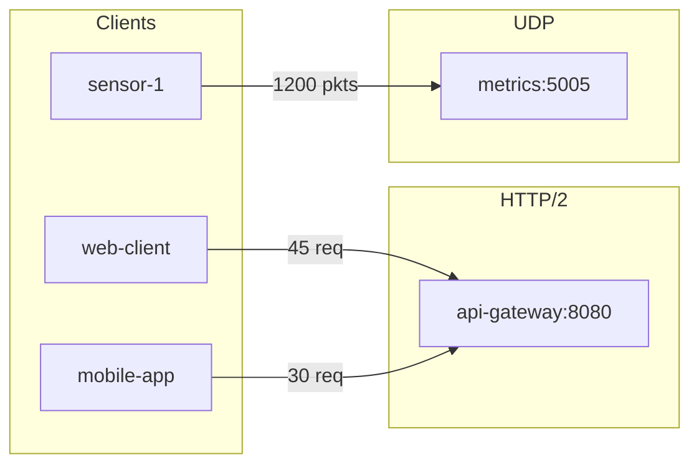

# Spec: Summary Visualization (Markdown Tables + Mermaid Flowcharts)

**Date:** 2026-01-07
**Status:** Draft - Pending Review

## Goal

Create visualization functions for the `Summary` data structure:
1. **Markdown tables** - Protocol, server, client rows with stats
2. **Mermaid flowcharts** - Network topology visualization with stats on arrows

---

## New Module

Create `PcapFileEx.Flows.Summary.Render` with:

```elixir
defmodule PcapFileEx.Flows.Summary.Render do
  @moduledoc """
  Render Summary data as markdown tables and Mermaid diagrams.
  """

  def to_markdown(summary, opts \\ [])
  def to_mermaid(summary, opts \\ [])
end
```

---

## 1. Markdown Table Format

### HTTP Services Table

| Protocol | Server | Client | Requests | Responses | Req Bytes | Res Bytes | Avg RT (ms) |
|----------|--------|--------|----------|-----------|-----------|-----------|-------------|
| http2 | api-gateway:8080 | web-client | 45 | 44 | 12,000 | 350,000 | 75 |
| http2 | api-gateway:8080 | mobile-app | 30 | 30 | 8,000 | 200,000 | 120 |
| http1 | legacy:80 | crawler | 10 | 10 | 500 | 5,000 | 200 |

### UDP Services Table

| Server | Client | Packets | Total Bytes | Avg Size | Min | Max |
|--------|--------|---------|-------------|----------|-----|-----|
| metrics:5005 | sensor-1 | 1,200 | 600,000 | 500 | 64 | 1,400 |
| metrics:5005 | sensor-2 | 800 | 400,000 | 500 | 64 | 1,400 |

### Implementation

```elixir
def to_markdown(summary, opts \\ []) do
  sections = []

  # HTTP section (combined http1 + http2)
  http_services = summary.http1 ++ summary.http2
  if http_services != [] do
    sections = sections ++ [http_table(http_services, opts)]
  end

  # UDP section
  if summary.udp != [] do
    sections = sections ++ [udp_table(summary.udp, opts)]
  end

  Enum.join(sections, "\n\n")
end
```

### Options
- `:title` - Add section titles (default: true)
- `:humanize_bytes` - Format bytes as KB/MB (default: true)
- `:protocol` - Filter to :http1, :http2, :udp, or :all (default: :all)

---

## 2. Mermaid Flowchart

### Target Output



### Implementation

```elixir
def to_mermaid(summary, opts \\ []) do
  direction = Keyword.get(opts, :direction, :lr)

  [
    "flowchart #{direction_str(direction)}",
    client_subgraph(summary),
    service_subgraphs(summary),
    connections(summary)  # with stats labels
  ]
  |> List.flatten()
  |> Enum.join("\n")
end
```

### Options
- `:direction` - :lr (left-right, default) or :tb (top-bottom)
- `:group_by` - :protocol (default) or :none

---

## Files to Create/Modify

### New Files
- `lib/pcap_file_ex/flows/summary/render.ex` - Main render module

### Test Files
- `test/pcap_file_ex/flows/summary/render_test.exs` - Tests for both formats

---

## Implementation Order

1. Create `Render` module with `to_markdown/2`
   - HTTP table generation (combined http1 + http2)
   - UDP table generation
   - Number formatting helpers (humanize bytes)

2. Add `to_mermaid/2`
   - Flowchart generation
   - Node ID sanitization (handle special chars in hostnames)
   - Stats labels on arrows ("45 req", "1200 pkts")

3. Add tests
   - Empty summary
   - HTTP-only, UDP-only, mixed
   - Special characters in hostnames

4. Update documentation (CHANGELOG, README, usage-rules/flows.md)

---

## Design Decisions

1. **Flowchart over Block Diagram** - Flowcharts have better support for labeled arrows showing traffic stats.

2. **Stats on Arrows** - Show request/packet counts on connection arrows (e.g., "45 req", "1200 pkts").

3. **Group by Protocol** - Services grouped into subgraphs by protocol (HTTP/1, HTTP/2, UDP).

4. **Separate Tables for HTTP vs UDP** - Different stats columns make a unified table awkward.
